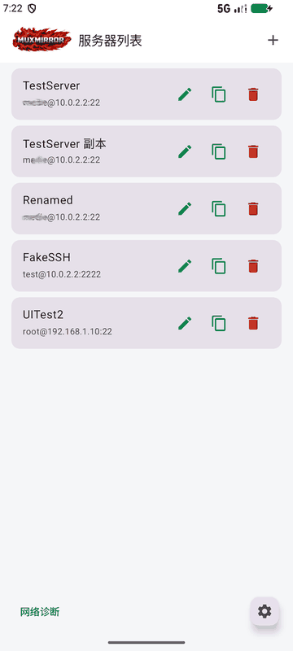
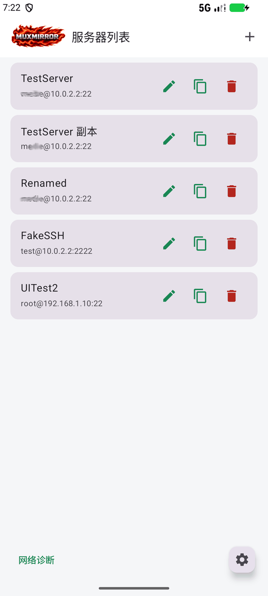
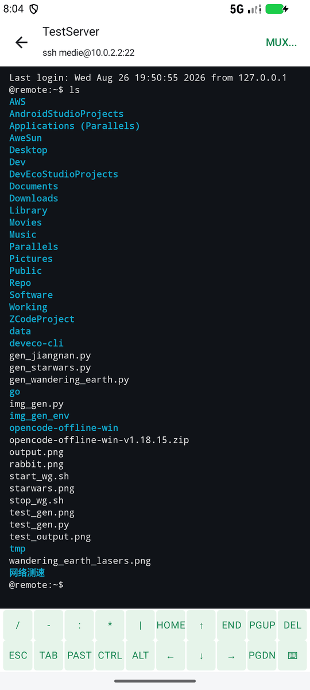
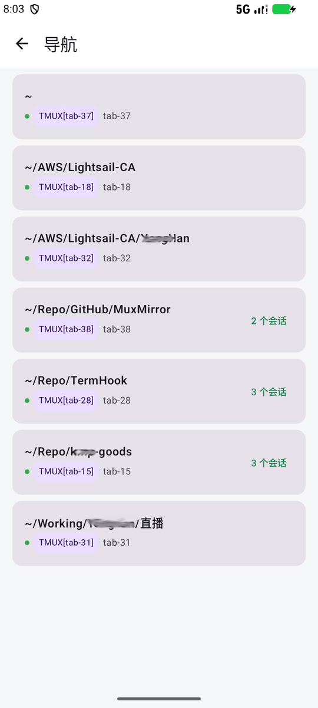

# MuxMirror

MuxMirror 是一个远程终端工具：手机 App 通过 SSH 直连电脑，远程查看和操作电脑上的终端窗口/标签页。无需改变终端使用习惯，直接呈现 PC 上已有的终端会话，手机端即开即用。

- `MirrorServer/`：电脑端 CLI（macOS），负责终端窗口枚举、画面同步、输入转发。
- `MobileApp/`：手机端 App，支持 HarmonyOS / Android / iOS。

## 界面预览



| 服务器列表 | 终端 | MUX 导航 |
|---|---|---|
|  |  |  |

以上为 Android 端真实截图：模拟器经 `10.0.2.2` SSH 直连本机，MUX 导航按工作目录分组展示本机 tmux 会话。

## 一、电脑端安装（macOS）

前置要求：Rust 工具链（cargo）、Xcode Command Line Tools（swiftc）。

```sh
scripts/install-muxmirror.sh
```

安装程序会构建并安装：

- 主程序：`~/.termimirror/bin/muxmirror`
- 辅助功能 Helper：`~/.termimirror/libexec/muxmirror/muxmirror-ax-helper`

安装结束后会主动请求 macOS 辅助功能权限并打开「系统设置 → 隐私与安全性 → 辅助功能」，请允许显示的 MuxMirror/SSH 相关条目（通常是 `sshd-keygen-wrapper`）。完成后复检：

```sh
~/.termimirror/bin/muxmirror doctor
```

注意：

- 建议把 `~/.termimirror/bin` 加入 `PATH`。
- 安装过程中 `setup`/`doctor` 会通过 `localhost` SSH 自检，可能要求输入本机密码，属正常现象。
- 窗口扫描依赖辅助功能权限；权限未授予时会提示重新执行 `muxmirror setup`。

## 二、电脑端 tmux 配置（推荐）

为配合手机端远程操作，建议电脑端 Apple Terminal 配置「开终端自动进 tmux、新标签页继承当前路径、关标签页自动清理会话」。

### `~/.tmux.conf`

非必须，按需参考：

```tmux
set -g history-limit 5000
set -g mouse off
set -g set-clipboard on
# 允许 pane 内 OSC 7（cwd 上报）透传给外层终端，使新建标签页继承 tmux 内最新路径
set -g allow-passthrough on
# 手动 detach 时保留会话，并让 tmux client 原地切回登录 zsh
bind-key d set-option destroy-unattached off \; detach-client -E 'TERMHOOK_TMUX_DETACHED=1 exec zsh -l'
```

### `~/.zshrc` 追加

每次开启新终端，自动进入 tumx，自动分配 id，如果你不需要启动终端自动进入 tmux，那么可忽略。

<details>
<summary>点击展开完整配置（约 100 行，展开后右上角复制按钮可复制全部）</summary>

```sh
# 进入终端后自动启动 tmux；已经在 tmux/rmux 里就不再重入。
# 每个新终端窗口自增编号开启新会话 tab-${id}:
#   初次读不到id记录就当current_id=0，新会话用 current_id+1，再把 current_id 写入持久状态
# 每次新建终端窗口，都cd ~/，新标签页继承当前窗口的最新当前路径:
#   需要记录每个终端窗口的当前目录，测试用例：新建终端窗口A，当前目录应该是在~/，执行cd path1, 新建标签页，会
#   自动cd 到path1，新建终端窗口B，cd path2, 新建标签页，会自动cd 到path2，再回到终端窗口A，新建标签页，需
#   要自动cd 到path1，而不是path2
start_tmux_once() {
    if [[ -o interactive
        && -z "${SSH_CONNECTION:-}"
        && -z "${TMUX:-}"
        && -z "${RMUX:-}"
        && -z "${TERMHOOK_TMUX_DETACHED:-}"
        && "${TERM:-}" != (screen|tmux|rmux)*
        && -n "${commands[tmux]:-}" ]]; then
        _auto_start_tmux() {
            local session_name
            local next_id=1
            local attempt=0
            local tmux_exit_code=0

            # 只统计 tab-N 会话；从当前最大编号继续递增，其他命名的会话不参与。
            while IFS= read -r session_name; do
                if [[ "$session_name" == tab-<-> ]]; then
                    local num="${session_name#tab-}"
                    if (( num >= next_id )); then
                        next_id=$((num + 1))
                    fi
                fi
            done < <(command tmux list-sessions -F '#{session_name}' 2>/dev/null)

            # 并发打开多个终端时，后启动者若撞号则继续尝试下一个编号。
            while (( attempt < 20 )); do
                # 先以 detached 模式原子占用会话名，避免撞号失败时 trap 误删其他会话。
                command tmux new-session -d -s "tab-$next_id" -c "$PWD"
                tmux_exit_code=$?
                if (( tmux_exit_code == 0 )); then
                    session_name="tab-$next_id"
                    # attach 时启用服务端清理；还有手机 client 时会话会保留，最后
                    # 一个 client 离开后才销毁。Ctrl-b d 的绑定会先关闭此选项。
                    command tmux set-hook -t "$session_name" client-attached \
                        'set-option destroy-unattached on'
                    # 必须替换外层 zsh。若让 zsh 等待 tmux 子进程，Terminal.app
                    # 关闭时会等待约 10 秒才销毁 TTY。
                    exec tmux attach-session -t "=$session_name"
                    return 1
                fi
                if command tmux has-session -t "=tab-$next_id" 2>/dev/null; then
                    next_id=$((next_id + 1))
                    attempt=$((attempt + 1))
                else
                    return "$tmux_exit_code"
                fi
            done
            return 1
        }

        _auto_start_tmux
        unfunction _auto_start_tmux
    fi

    # tmux 内把 cwd 上报（OSC 7）经 DCS passthrough 透传给外层终端（需 tmux 开启
    # allow-passthrough）。否则终端只能记住标签页启动时的目录，tmux 内 cd 后新建
    # 标签页不会跟随。
    if [[ -n "${TMUX:-}" ]]; then
        # tmux 会把 TERM_PROGRAM 改成 tmux，/etc/zshrc 按 TERM_PROGRAM 加载集成脚本，
        # 因此 pane 内 update_terminal_cwd 未定义，需手动补载 Apple 终端集成。
        (( $+functions[update_terminal_cwd] )) || source /etc/zshrc_Apple_Terminal
        if (( $+functions[update_terminal_cwd] )); then
            _tmux_passthrough_terminal_cwd() {
                local seq esc=$'\e'
                seq=$(update_terminal_cwd)
                # 透传封装要求序列内的每个 ESC 翻倍（zsh 替换中的 $'' 不会展开，故用变量）
                [[ -n "$seq" ]] && printf '\ePtmux;%s\e\\' "${seq//$esc/$esc$esc}"
            }
            autoload -Uz add-zsh-hook
            add-zsh-hook precmd _tmux_passthrough_terminal_cwd
        fi
    fi
}

start_tmux_once
unset TERMHOOK_TMUX_DETACHED


# 标签页关闭时（zsh 退出），清理对应的 tmux 会话。
# 仅当该会话已无其他 client 时才杀——手机 SSH 远程 attach 时它是另一个 client，不会被清理。
_cleanup_tmux_on_exit() {
    [[ -z "${TMUX:-}" ]] && return
    # TMUX 格式: "session:window.pane"
    local session="${TMUX%%:*}"
    [[ -z "$session" ]] && return
    # 稍等片刻让 client 真正 detach，再检查是否还有其他 client
    ( sleep 0.2 && tmux has-session -t "=$session" 2>/dev/null \
        && [ "$(tmux list-clients -t "=$session" 2>/dev/null | wc -l | tr -d ' ')" = "0" ] \
        && tmux kill-session -t "=$session" 2>/dev/null ) &!
}
autoload -Uz add-zsh-hook
add-zsh-hook zshexit _cleanup_tmux_on_exit
```

</details>

## 三、手机端 App 构建与安装

### HarmonyOS

前置要求：DevEco Studio 命令行工具（devecocli）、hdc、OHOS Rust target。

```sh
./scripts/deploy-harmony.sh sim     # 部署到模拟器
./scripts/deploy-harmony.sh device  # 部署到真机
./scripts/deploy-harmony.sh all     # 模拟器 + 真机
```

脚本会完成 Rust 核心交叉编译、`.so` 拷贝、HAP 构建、安装并启动。

### Android / iOS

```sh
./scripts/deploy-mobile.sh android  # Android 模拟器
./scripts/deploy-mobile.sh ios      # iOS 模拟器（iPhone 17 Pro）
./scripts/deploy-mobile.sh all      # 两端
```

也可手动分步构建：先构建 Rust 核心，再编译原生工程。

```sh
cd MobileApp/shared
bash scripts/build-ohos.sh     # 鸿蒙
bash scripts/build-android.sh  # Android
bash scripts/build-ios.sh      # iOS
```

## 四、使用注意事项

- **网络**：手机与电脑需网络互通；手机端通过标准 SSH 连接电脑，请先在 macOS「系统设置 → 共享」中开启「远程登录」。
- **认证**：当前仅支持 IPv4 + 密码认证，公钥认证待补齐。
- **macOS sshd 源地址限制**：若 `/etc/ssh/sshd_config` 配置了 `AllowUsers user@<网段>`，需包含手机所在网段；鸿蒙模拟器连接时来源为 `127.0.0.1`，需额外放行 `127.0.0.0/8`，否则密码正确也会认证失败。排查详见 `docs/memory/feedback/2026-07-17-ssh-allowusers-source-restriction.md`。
- **软键盘交互**：移动端内置双行工具条，支持常用符号、方向键、翻页、Ctrl/Alt 锁定、安全粘贴；全屏 TUI（如 Codex）下支持双指纵向滑动回看历史。
- **画面同步限制**：macOS 上 Terminal.app 的画面读取与输入转发基于 AppleScript，受权限和轮询延迟限制；输入转发在无辅助功能权限时会降级为 `do script`（会污染 shell 历史）。Linux 下输入转发可用，画面读取受限。

## 当前平台支持

| 平台 | 状态 |
|------|------|
| 电脑端 macOS | 可用（Terminal.app / iTerm2） |
| 电脑端 Linux | 部分可用（画面读取受限） |
| 电脑端 Windows | 仅 managed PTY（Windows 10 1809+） |
| 手机端 HarmonyOS | 可用 |
| 手机端 Android / iOS | 主要功能已就绪，细节打磨中 |
